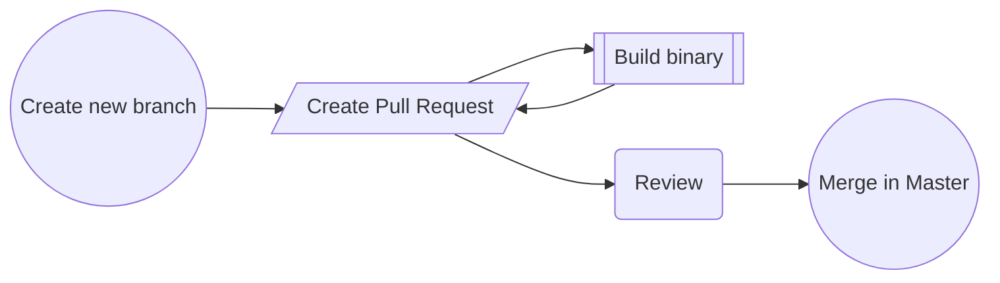
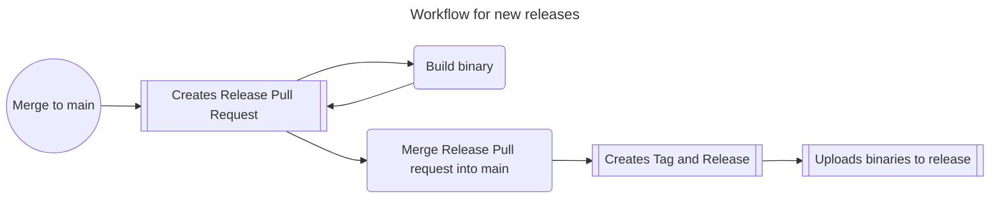

# Contribute

## 👩‍💻 How to contribute

### Development

1. Fork the repository
2. Create a new branch
3. Make your changes
4. Create a pull request
5. Address any review comments
6. Merge the pull request once it is approved

### Bug reports

1. Create a new issue
2. Describe the steps to reproduce the bug
3. Describe the expected behavior
4. Describe the actual behavior
5. Describe the environment
(OS, browser, etc.)
6. Include any relevant stack traces or error messages

## 👷‍♀️ Development

### Requirements

* [PlatformIO](https://platformio.org/)
* [PlatformIO IDE](https://platformio.org/platformio-ide) for your favorite IDE

### Configuration

Get the merged platformio.ini configuration for debugging:

```bash
pio project config
```

Get default environment:

```bash
pio project config --json-output | jq -cr '.[0][1][0][1]'
```

Result: `["heltec_wifi_lora_32_V3_HCSR04"]`

### Build & Upload

Build the project:

```bash
pio run --environment <environment>
```

Build and upload the project:

```bash
pio run --target upload --environment <environment>
```

## Debug level

The debug level can be set in the `platformio.ini` file.

```ini
[env:heltec_wifi_lora_32_V3_HCSR04]
```

## 🤖 Deployment

### Semantic versioning

We follow [semantic versioning](https://semver.org/) for this project.

### Conventional Commits

We use [conventional commits](https://www.conventionalcommits.org/en/v1.0.0/) for this project.
Please use the following commit message format:

```text
<type>[optional scope]: <description>
````

The `<type>` must be one of the following:

| Type | Description | Bump |
| --- | --- | --- |
| `feat` | A new feature | minor |
| `fix` | A bug fix | patch |
| `docs` | Documentation only changes | patch |
| `style` | Changes that do not affect the meaning of the code (white-space, formatting, missing semi-colons, etc)
| `refactor` | A code change that neither fixes a bug nor adds a feature | patch |
| `perf` | A code change that improves performance | patch |
| `test` | Adding missing tests or correcting existing tests | patch |
| `chore` | Changes to the build process or auxiliary tools and libraries such as documentation generation | patch |

**Example:**

```text
feat: add support for new sensor
```

### Release management

We use [release please](https://github.com/googleapis/release-please) for this project.
It is implemented in our [release workflow](.github/workflows/release.yml).
It collects all commits since the last release in a release pull request.
Use the [conventional commit](#conventional-commits) message format for your commits like it is described above.
Please write your messages very easy to understand for none developers and a bit more
verbose as useally because it will be used for the Changelog and Release-Notes.

### Workflow for your new feature

1. Create a new branch `feature/sensor-xvz`
2. Develop your feature in your feature branch
3. Create a pull request from your feature branch to the `main` branch
4. Address any review comments
5. Merge the pull request once it is approved and delete your feature branch
6. If not allready done, *please release* will automatically create a new release pull request. This pull request will include your changes.
7. To create a new release, you have to merge the release pull request into the master



### Workflow for new releases

1. Merge everthing into the main branch
2. An release pull request will be created automatically by the GitHub Actions workflow
3. Check the release pull request and merge it into the main branch


