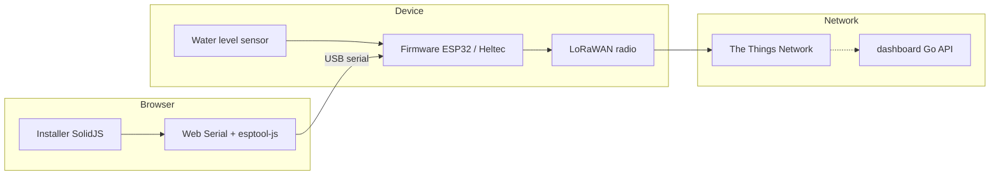

# Architecture

regenfass splits into three cooperating layers: **firmware on the device**, **browser tools** for flashing and configuration, and an optional **dashboard** API for networked data.

## Firmware

- **Stack:** PlatformIO, Arduino framework, C++17, LoRaWAN 1.0.2 OTAA (LMIC family — see `platformio.ini` / `lib_deps`).
- **Role:** Read sensors, drive display/buttons, join TTN, uplink telemetry.
- **Config:** Sensitive keys and feature flags live in PlatformIO config / `src/config/` — not in public web bundles.
- **SCP:** Serial Configuration Protocol under `lib/scp/` lets tools (including the installer) talk to the device over serial once flashed.

## Web installer (`web/installer`)

- **Stack:** SolidJS, Vite, TypeScript, Tailwind, XState, shadcn-solid patterns, solid-icons, `@regenfass/brand`.
- **Role:** Guided UI to flash firmware manifests and configure device settings via Web Serial.
- **UI model:** Atomic Design — atoms → molecules → organisms → templates/pages (see [Component Structure](Component-Structure)).
- **State:** Installer machine and forms under `web/installer/src/installer/`; serial / flash helpers under `web/installer/src/libs/`.

## Shared brand (`web/brand`)

Exportable SolidJS primitives and theme (`@regenfass/brand`, `./styles.css`, `./tailwind.preset.cjs`) so installer, showcase, and future sites share the same look. Apps alias brand paths in their Vite configs where needed.

## Other web apps

- **brand-showcase** — interactive playground for brand components (dev port 5174).
- **marketing** / **docs** — public marketing and documentation sites (root scripts `dev:marketing`, `dev:docs`); deploy via Netlify (see [Netlify Deployment](Netlify-Deployment)).

## Dashboard (`web/dashboard/`)

Go HTTP API (`localhost:64000` in swagger metadata) with sqlc SQL and optional Docker/Grafana. Firmware uplinks primarily go through TTN; the dashboard is for project services that need HTTP access to device/sensor data — not a required dependency to develop the installer or flash a board.

## Boundaries

| Concern             | Must not                        |
| ------------------- | ------------------------------- |
| Installer UI        | Introduce React                 |
| Firmware            | Depend on Node / pnpm           |
| Brand package       | Own app-only flash/serial logic |
| Contributor `docs/` | Nested wiki folders             |
