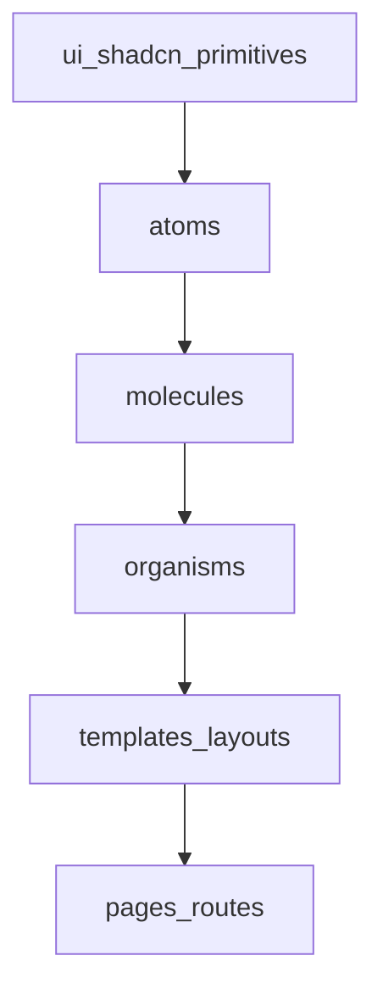

# Component structure

Applies to the installer UI under `web/installer`, mapped to [Atomic Design (Brad Frost, chapter 2)](https://atomicdesign.bradfrost.com/chapter-2/). This is a mental model for moving between detail and whole — not a rigid “build all atoms first” pipeline.

## Layers

| Stage | Location |
|-------|----------|
| **Atoms** | `web/installer/src/components/atoms/` |
| **Molecules** | `web/installer/src/components/molecules/` |
| **Organisms** | `web/installer/src/components/organisms/` |
| **Templates** | Layout shells (e.g. `MainApp` in `web/installer/src/App.tsx`, playground under `web/installer/src/playground/`) |
| **Pages** | Routed screens with real content and states |

## Special folders

| Folder | Role |
|--------|------|
| `web/installer/src/components/ui/` | Thin shadcn-solid primitives; avoid installer domain logic here |
| `web/installer/src/components/forms/` | Form building blocks (often molecule-level) |

## Import direction

- Atoms must not import molecules or organisms.
- Molecules may use atoms, `ui/`, and shared libs; must not import organisms.
- Organisms compose lower layers.
- Exception: atoms may use primitives (Kobalte, `ui/*`) like base HTML elements.

## Shared brand

Reusable, cross-app pieces live in `web/brand` (`@regenfass/brand`) — atoms/molecules/organisms mirrored there for the design system. The brand-showcase app renders them for visual QA.

## Tests and docs

- Tests: `web/installer/tests/components/…` mirrors `src/components/…`.
- Hand-written component docs: `web/installer/docs/` (match existing layout).
- After prop changes: update types, hand-written docs if needed, run `pnpm docs:components`, and `pnpm playground:registry` when the playground workflow applies.

Cursor rule: `.cursor/rules/atomic-design-installer.mdc`.
