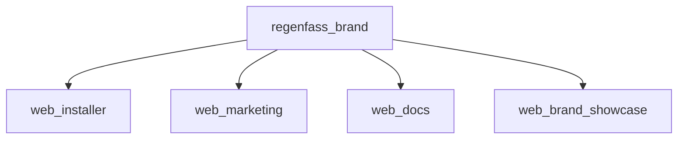

# Component structure

Shared UI lives in `web/brand` (`@regenfass/brand`). The installer, marketing site, user docs site, and brand showcase all consume that package. [Atomic Design (Brad Frost, chapter 2)](https://atomicdesign.bradfrost.com/chapter-2/) is the mental model — not a rigid “build all atoms first” pipeline.

## Layers

| Stage         | Location                                                                                                                                              |
| ------------- | ----------------------------------------------------------------------------------------------------------------------------------------------------- |
| **Atoms**     | `web/brand/src/components/atoms/`                                                                                                                     |
| **Molecules** | Shared under `web/brand/src/components/molecules/`; installer-specific flows (steps, Flasher) stay in `web/installer/src/components/molecules/`       |
| **Organisms** | Shared Header/Footer/Newsletter under `web/brand/src/components/organisms/`; installer-only organisms under `web/installer/src/components/organisms/` |
| **Templates** | Layout shells (e.g. `MainApp` in `web/installer/src/App.tsx`, brand showcase under `web/brand-showcase/`)                                             |
| **Pages**     | Routed screens with real content and states                                                                                                           |

## Special folders

| Folder                            | Role                                                    |
| --------------------------------- | ------------------------------------------------------- |
| `web/brand/src/components/ui/`    | Thin shadcn-solid primitives; no installer domain logic |
| `web/brand/src/components/forms/` | Shared form building blocks (often molecule-level)      |

## Import direction

- Atoms must not import molecules or organisms.
- Molecules may use atoms, `ui/`, and shared libs; must not import organisms.
- Organisms compose lower layers.
- Exception: atoms may use primitives (Kobalte, `ui/*`) like base HTML elements.
- Web apps import shared pieces from `@regenfass/brand` — do not duplicate them.

## Tests and docs

- Installer tests: `web/installer/tests/components/…` mirrors installer `src/components/…` for installer-specific UI.
- Brand component tests, when added, should live next to the brand package.
- Hand-written component docs: `web/installer/docs/` (match existing layout).
- After prop changes on shared components: update types in `web/brand`, hand-written docs if needed, and verify brand-showcase still renders.

Cursor rule: `.agents/rules/atomic-design-installer.mdc`.
