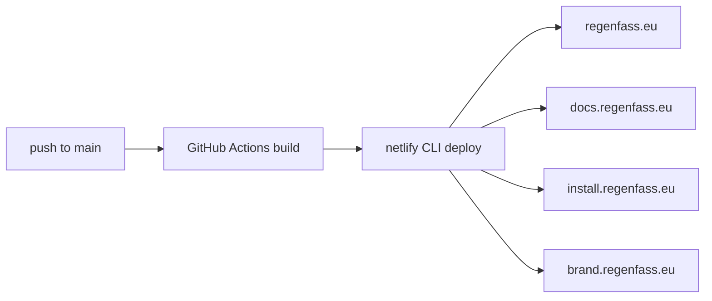

# Netlify deployment (all web apps)

Web apps are **built on GitHub Actions** and **hosted on Netlify**. Netlify’s own builder is intentionally skipped so monorepo/`pnpm` workspace builds stay on CI.



## Target sites and subdomains

| Public URL | Netlify site (suggested name) | Publish dir (from repo root) | Site ID secret |
|------------|-------------------------------|------------------------------|----------------|
| <https://regenfass.eu> | `regenfass-marketing` | `web/marketing/dist` | `NETLIFY_SITE_ID_MARKETING` |
| <https://docs.regenfass.eu> | `regenfass-docs` | `web/docs/dist` | `NETLIFY_SITE_ID_DOCS` |
| <https://install.regenfass.eu> | `regenfass-installer` | `web/installer/dist` | `NETLIFY_SITE_ID_INSTALLER` |
| <https://brand.regenfass.eu> | `regenfass-brand` | `web/brand-showcase/dist` | `NETLIFY_SITE_ID_BRAND` |

Auth for all deploys: `NETLIFY_AUTH_TOKEN` (personal access token or Netlify deploy token with site deploy rights).

Workflow: `.github/workflows/web-deploy-netlify.yml`.

## Why not build on Netlify?

A previous Netlify setup used `cd ../..` inside `web/*/netlify.toml`, which assumes a package **Base directory**. With Base directory left empty (repo root = `/opt/build/repo`), that `cd` ends up in `/opt` and fails with `ERR_PNPM_NO_PKG_MANIFEST`.

Building in GitHub Actions keeps one workspace install (`pnpm install` at the monorepo root), shared `@regenfass/brand`, and identical artifacts for all four sites.

## One-time Netlify setup

For each of the four sites:

1. **Add site** in Netlify (empty site or “Import from Git”, then disable auto-build — see below).
2. Attach the custom domain (table above) and wait for DNS + HTTPS.
3. Copy the **Site ID** (Site configuration → Site details → Site ID) into the matching GitHub secret.
4. Create a Netlify **personal access token** (User settings → Applications → Personal access tokens) and store it as GitHub secret `NETLIFY_AUTH_TOKEN`.

### Stop Netlify from building on every git push

Each `web/*/netlify.toml` sets:

```toml
[build]
  ignore = "exit 0"
```

So if the GitHub repo is still linked for continuous deployment, Netlify **skips** its builder. Production updates come only from the Actions workflow (`netlify deploy --prod --dir=…`).

Also set in the Netlify UI (recommended):

- **Base directory:** empty (repository root) — do **not** set `web/docs` etc. if you still keep a linked repo
- Or disconnect “Build settings → Stop builds” / use deploy-only sites created without a Git link (CLI-only)

### SPA redirects

Each app has `public/_redirects` (`/* → /index.html` 200) so client-side routes survive refresh after CLI deploys. The same rule remains in `netlify.toml` for reference.

## GitHub secrets checklist

| Secret | Purpose |
|--------|---------|
| `NETLIFY_AUTH_TOKEN` | Authenticate `netlify deploy` |
| `NETLIFY_SITE_ID_MARKETING` | Marketing site ID |
| `NETLIFY_SITE_ID_DOCS` | Docs site ID |
| `NETLIFY_SITE_ID_INSTALLER` | Installer site ID |
| `NETLIFY_SITE_ID_BRAND` | Brand showcase site ID |

Missing secrets log a warning and skip that site; the job still succeeds so you can roll out sites one by one.

## Manual / local deploy

```bash
corepack enable && pnpm install
pnpm build:docs   # or :marketing / :installer / :brand

export NETLIFY_AUTH_TOKEN=…
export NETLIFY_SITE_ID=…   # that site’s ID
npx netlify-cli deploy --prod --dir=web/docs/dist
```

## Fallback build command (if you must build on Netlify)

Leave **Base directory empty** (repo root) and use a root-relative command — **never** `cd ../..` from root:

```toml
[build]
  command = "corepack enable && pnpm install --frozen-lockfile && pnpm --filter @ttnleipzig/regenfass-docs-site build"
  publish = "web/docs/dist"
```

Remove or comment `ignore = "exit 0"` only if you intentionally switch back to Netlify builds.

## Related

- [Deployment](Deployment) — overview
- [Build Process](Build-Process)
- Workflow: `.github/workflows/web-deploy-netlify.yml`
