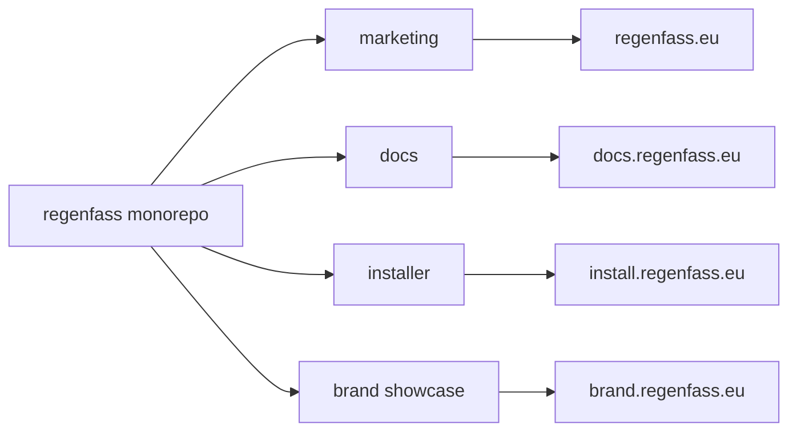

# Netlify deployment (all web apps)

Deploy **four separate Netlify sites** from this monorepo — one per web app. Each site gets its **own subdomain**. Shared UI (`@regenfass/brand`) is not deployed alone; every app bundles it at build time.



## Target sites and subdomains

| Public URL | Netlify site (suggested name) | Base directory | Package filter | Publish |
|------------|-------------------------------|----------------|----------------|---------|
| <https://regenfass.eu> | `regenfass-marketing` | `web/marketing` | `@ttnleipzig/regenfass-marketing` | `dist` |
| <https://docs.regenfass.eu> | `regenfass-docs` | `web/docs` | `@ttnleipzig/regenfass-docs-site` | `dist` |
| <https://install.regenfass.eu> | `regenfass-installer` | `web/installer` | `@ttnleipzig/regenfass-installer` | `dist` |
| <https://brand.regenfass.eu> | `regenfass-brand` | `web/brand-showcase` | `@ttnleipzig/regenfass-brand-showcase` | `dist` |

Each package already ships:

- `netlify.toml` — build command + SPA fallback
- `public/CNAME` — the production hostname (useful as a reminder; Netlify custom domains are still configured in the UI/DNS)

## Why four sites (not one)?

Netlify’s **Base directory** is per site. One site cannot cleanly publish four different `dist` folders with four hostnames from separate Vite apps. Four sites keep builds isolated, domains simple, and rollbacks independent.

## Prerequisites

1. A Netlify account with permission to connect this GitHub repository.
2. Access to DNS for `regenfass.eu` (to create CNAME / ALIAS records).
3. Node **20+** on Netlify builders (Corepack activates the pinned `pnpm` from the root `package.json`).

## Step-by-step: create each site

Repeat this once per row in the table above (marketing, docs, installer, brand).

### 1. Create the site

1. In Netlify: **Add new site → Import an existing project**.
2. Choose the **regenfass** GitHub repository.
3. Branch to deploy: usually `main` (or the branch you cut over from).

### 2. Build settings

In **Build settings** (or from the package’s `netlify.toml` after Base directory is set):

| Setting | Value |
|---------|--------|
| **Base directory** | The app path, e.g. `web/marketing` |
| **Build command** | Taken from that folder’s `netlify.toml` (see below) |
| **Publish directory** | `dist` (relative to the base directory) |

Example installer’s `web/installer/netlify.toml`:

```toml
[build]
  command = "cd ../.. && corepack enable && pnpm install && pnpm --filter @ttnleipzig/regenfass-installer build"
  publish = "dist"

[[redirects]]
  from = "/*"
  to = "/index.html"
  status = 200
```

Marketing / docs / brand use the same pattern with their own filter names. The `cd ../..` jumps to the monorepo root so `pnpm-workspace.yaml`, the root lockfile, and `@regenfass/brand` all resolve.

### 3. Environment / Node (optional but recommended)

If builds complain about Node or Corepack:

- Site settings → **Environment variables** → set `NODE_VERSION` to `22` (or `20`).
- Do **not** run `pnpm install` only inside `web/<app>` without the root workspace — the shared brand package will break.

### 4. Attach the subdomain

1. Site → **Domain management** → **Add custom domain**.
2. Enter the hostname from the table (`docs.regenfass.eu`, `install.regenfass.eu`, `brand.regenfass.eu`, or apex `regenfass.eu`).
3. Netlify shows the DNS records to create. Typical pattern:

| Hostname | Type | Value (example) |
|----------|------|-----------------|
| `regenfass.eu` | ALIAS / ANAME / or Netlify DNS | Netlify’s apex guidance for the marketing site |
| `docs.regenfass.eu` | CNAME | `<docs-site-name>.netlify.app` |
| `install.regenfass.eu` | CNAME | `<installer-site-name>.netlify.app` |
| `brand.regenfass.eu` | CNAME | `<brand-site-name>.netlify.app` |

4. Wait for DNS + TLS (Let’s Encrypt) to become **Active**.
5. Prefer **HTTPS only** redirects once certificates are ready.

Use **one custom domain primary hostname per site**. Do not point two Netlify sites at the same hostname.

### 5. Confirm the SPA redirect

All four apps are Solid/Vite SPAs. Each `netlify.toml` already includes:

```toml
[[redirects]]
  from = "/*"
  to = "/index.html"
  status = 200
```

That keeps client-side routes (and the docs reader) working on refresh.

### 6. Smoke-test after the first deploy

| Site | Quick check |
|------|-------------|
| Marketing | Home loads; “Get started” / Docs links resolve |
| Docs | Sidebar navigation works; refresh on a content URL still returns HTML |
| Installer | Welcome screen; Web Serial still needs Chromium + USB hardware |
| Brand | Component gallery loads; theme toggle works |

## Checklist for all four sites

- [ ] Four Netlify sites linked to this repo
- [ ] Base directories: `web/marketing`, `web/docs`, `web/installer`, `web/brand-showcase`
- [ ] Builds succeed from `main` (workspace `pnpm install` + filter build)
- [ ] Custom domains + HTTPS: `regenfass.eu`, `docs.regenfass.eu`, `install.regenfass.eu`, `brand.regenfass.eu`
- [ ] SPA redirects present
- [ ] Old hosts (GitHub Pages for the installer, external `regenfass-docs` site) redirected or decommissioned after cutover

## DNS cutover tips

- Lower TTL on the records a day before switching if the registrar allows it.
- For `install.regenfass.eu`, if GitHub Pages still owns the CNAME, update DNS to the Netlify target only after the Netlify site builds cleanly.
- Keep GitHub Pages (`installer-deploy.yml`) as a temporary fallback until Netlify traffic is verified, then disable Pages when ready (see [Deployment](Deployment)).

## Troubleshooting

| Symptom | Likely fix |
|---------|------------|
| `@regenfass/brand` not found | Base directory wrong, or build never `cd`s to repo root / never runs root `pnpm install` |
| 404 on deep links | Missing `/*` → `/index.html` redirect |
| Wrong app on a domain | Custom domain assigned to the wrong Netlify site |
| Lockfile / pnpm errors | Run from monorepo root with Corepack; Node 20+ |
| Huge build times | Normal on cold cache; Netlify dependency caching helps after the first green build |

## Related docs

- [Deployment](Deployment) — overview of Pages vs Netlify
- [Build Process](Build-Process) — local and CI builds
- [Local Development](Local-Development) — `pnpm dev:*` ports for local checks before deploy
