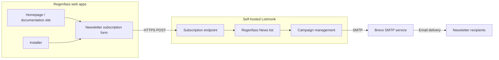

# Newsletter Architecture

The Regenfass newsletter uses a self-hosted Listmonk instance to manage subscribers and Brevo as the SMTP service for delivering email. This keeps the subscription and list-management workflow under our control while using Brevo as the outbound mail relay.

## System overview

Listmonk is the central system for newsletter subscriptions, list membership, and campaign management. Brevo is used only as the SMTP service that sends the messages prepared by Listmonk.

## Components

### Newsletter form

The shared Regenfass brand package provides the newsletter form used by the web applications. The form submits the subscriber's email address directly to the public Listmonk subscription endpoint:

<https://news.regenfass.eu/subscription/form>

The public form currently offers the **Regenfass News** list. A subscriber enters an email address, optionally provides a name, and submits the form. Listmonk then handles the subscription workflow and list membership.

### Self-hosted Listmonk

Listmonk is responsible for:

- storing and managing newsletter subscribers;
- assigning subscribers to the **Regenfass News** list;
- handling subscriptions and unsubscribes;
- preparing and managing newsletter campaigns; and
- handing outgoing messages to the configured SMTP service.

The Listmonk installation is self-hosted. Its administration interface is the place to maintain lists, review subscribers, and manage newsletter campaigns.

### Brevo SMTP

Brevo is configured as Listmonk's SMTP relay. It provides the outbound email transport and delivers the newsletter to recipients. Brevo is not the source of truth for newsletter lists in this setup, and it is not used as the public subscription form.

Brevo administration and automation settings are available at:

<https://app.brevo.com/automation/automations>

## Typical workflows

### A new subscription

1. A visitor opens the newsletter form on the homepage, documentation site, or installer.
2. The form sends the email address to Listmonk over HTTPS.
3. Listmonk adds the subscriber to the **Regenfass News** list and applies its configured subscription process.

### Maintaining the list

List maintenance takes place in Listmonk. Use it to review subscribers, manage list membership, and process unsubscribes. The application UI should only contain the public signup form; subscriber data should not be maintained separately in the web applications.

### Sending a newsletter

1. Create and configure the campaign in Listmonk.
2. Select the appropriate subscriber list and review the recipients.
3. Start the campaign in Listmonk.
4. Listmonk hands the outgoing messages to Brevo over SMTP.
5. Brevo delivers the messages to the recipients.

### Unsubscribing

Unsubscribes are handled by Listmonk. The unsubscribe link in a newsletter leads to the Listmonk subscription-management flow, where the recipient can leave the list. Listmonk remains the authoritative place for the resulting subscription state.

## Privacy boundaries

The subscriber list and its management remain in the self-hosted Listmonk installation. For email delivery, Listmonk necessarily passes the information required to deliver each message to Brevo through SMTP. This means Brevo is part of the email-delivery path, but it does not replace Listmonk as the newsletter list-management system.

When changing this setup, review both the Listmonk configuration and the Brevo SMTP configuration. Keep credentials and other sensitive configuration values outside the repository, for example in environment-specific secrets.

## Useful links

- [Public newsletter subscription form](https://news.regenfass.eu/subscription/form)
- [Brevo automation dashboard](https://app.brevo.com/automation/automations)
- [Listmonk documentation](https://listmonk.app/docs/)
