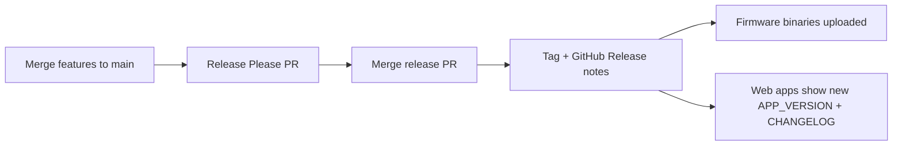

# Release process

## One version everywhere

Regenfass uses a **single semver** for firmware and all web apps. Source of truth:

| File | Role |
|------|------|
| `version.txt` | Release Please version file |
| `.release-please-manifest.json` | Manifest (`"."` → current version) |
| `CHANGELOG.md` | Human-readable release notes |
| `package.json` + `web/*/package.json` | Same `version` field (synced on release) |
| `web/brand/src/version.ts` | `APP_VERSION` shown in every web app footer |
| `src/version.h` | `REGENFASS_VERSION` for firmware serial/SCP |

Release Please bumps **all of these together** when the release PR merges (see `extra-files` in `.release-please-config.json`).

## Conventional Commits drive the changelog

Only commit **subjects** that start with a conventional type (`feat:`, `fix:`, …) are parsed. Do not prefix subjects with emojis. Prefer **squash merging** PRs into `main` so merge commits do not skip changelog parsing.

Bump heuristics (from CONTRIBUTING):

| Type | Typical bump |
|------|----------------|
| `feat` | minor |
| `fix`, `docs`, `refactor`, `perf`, `test`, `chore`, … | patch |

Breaking changes: `BREAKING CHANGE:` footer or `!` after type/scope.

## Feature workflow

1. Branch from `main` (for example `feature/…`).
2. Open a PR; address review; merge (squash preferred).
3. Release Please opens or updates a **release PR** collecting conventional commits. That PR updates `CHANGELOG.md`, `version.txt`, the manifest, package versions, `APP_VERSION`, and `REGENFASS_VERSION`.
4. Merge the release PR to create the **git tag** and a **GitHub Release** whose body is the new changelog section.

## Where release notes appear

1. **GitHub Releases** — <https://github.com/ttnleipzig/regenfass/releases> (Release Please writes the notes from `CHANGELOG.md`).
2. **Marketing site** — <https://regenfass.eu/#changelog> embeds the same `CHANGELOG.md` at build time.
3. **Every web app footer** — shows `v{APP_VERSION}` and a link to GitHub Releases (via `@regenfass/brand`).

## What gets released

- **Firmware:** `sketch-release.yml` builds PlatformIO environments and attaches `.bin` files to the GitHub Release (same tag / version).
- **Web apps:** deploy continuously (Netlify / Pages) from `main`. After a version bump merges, the next deploy shows the new `APP_VERSION` and changelog.

## Workflow configuration

`sketch-release.yml` runs Release Please with:

- `config-file: .release-please-config.json`
- `manifest-file: .release-please-manifest.json`

Do not pass a conflicting `release-type` in the action inputs; the config file is authoritative.

## Installer commit lint

When committing in a tree with installer Husky hooks active, subjects must satisfy `@commitlint/config-conventional` (`web/installer/commitlint.config.cjs`).
