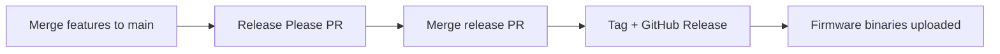

# Release process

## Versioning

The project uses [semantic versioning](https://semver.org/) and [Release Please](https://github.com/googleapis/release-please) (config: `.release-please-config.json`, version file `version.txt`).

## Conventional Commits drive the changelog

Only commit **subjects** that start with a conventional type (`feat:`, `fix:`, …) are parsed. Do not prefix subjects with emojis. Prefer **squash merging** PRs into `main` so merge commits do not skip changelog parsing.

Bump heuristics (from CONTRIBUTING):

| Type | Typical bump |
|------|----------------|
| `feat` | minor |
| `fix`, `docs`, `refactor`, `perf`, `test`, `chore`, … | patch |

Breaking changes: `BREAKING CHANGE:` footer or `!` after type/scope.

## Feature workflow

1. Branch from `main` (for example `feature/…`).
2. Open a PR; address review; merge (squash preferred).
3. Release Please opens or updates a **release PR** collecting conventional commits.
4. Merge the release PR to create the tag and GitHub Release.

## What gets released

- **Firmware:** `sketch-release.yml` builds PlatformIO environments and attaches `.bin` files to the release.
- **Web apps:** ship continuously via Netlify (and/or GitHub Pages for the installer). They are not necessarily versioned by the same `version.txt` tag unless you choose to align them manually.

## Installer commit lint

When committing in a tree with installer Husky hooks active, subjects must satisfy `@commitlint/config-conventional` (`web/installer/commitlint.config.cjs`).
