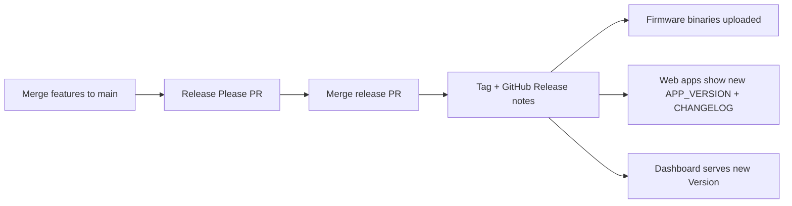

# Release process

## One version everywhere

Regenfass uses a **single semver** for firmware, installer, dashboard, docs, and
marketing. Release Please owns that number.

| File                                        | Role                                                                              |
| ------------------------------------------- | --------------------------------------------------------------------------------- |
| `.release-please-manifest.json`             | **Source of truth** (`"."` → current version). Do not hand-edit except bootstrap. |
| `package.json` + `web/*/package.json`       | Same `version` field (synced on release)                                          |
| `web/brand/src/version.ts`                  | `APP_VERSION` for installer, docs, and marketing UI                               |
| `firmware/src/version.h`                    | `REGENFASS_VERSION` for firmware serial/SCP                                       |
| `web/dashboard/internal/version/version.go` | Dashboard API / Swagger runtime version                                           |
| `CHANGELOG.md`                              | Human-readable release notes                                                      |

Release Please bumps **all synced artifacts together** when the release PR merges
(see `extra-files` in `.release-please-config.json`). Never hand-bump versions;
merge the release PR only.

### Where each surface reads the version

| Surface   | How the version appears                               |
| --------- | ----------------------------------------------------- |
| Firmware  | `REGENFASS_VERSION` (serial boot log + SCP `version`) |
| Installer | Brand footer `v{APP_VERSION}`                         |
| Docs site | Brand footer `v{APP_VERSION}`                         |
| Marketing | Brand footer + changelog label `v{APP_VERSION}`       |
| Dashboard | `internal/version.Version` (startup log + Swagger UI) |

CI runs `node scripts/check-version-sync.mjs` so these cannot drift from the
manifest.

## Conventional Commits drive the changelog

Only commit **subjects** that start with a conventional type (`feat:`, `fix:`, …) are parsed. Do not prefix subjects with emojis. Prefer **squash merging** PRs into `main` so merge commits do not skip changelog parsing.

Bump heuristics (from CONTRIBUTING):

| Type                                                  | Typical bump |
| ----------------------------------------------------- | ------------ |
| `feat`                                                | minor        |
| `fix`, `docs`, `refactor`, `perf`, `test`, `chore`, … | patch        |

Breaking changes: `BREAKING CHANGE:` footer or `!` after type/scope.

## Feature workflow

1. Branch from `main` (for example `feature/…`).
2. Open a PR; address review; merge (squash preferred).
3. Release Please opens or updates a **release PR** collecting conventional commits. That PR updates `CHANGELOG.md`, the manifest, package versions, `APP_VERSION`, `REGENFASS_VERSION`, and the dashboard `Version` const.
4. Merge the release PR to create the **git tag** and a **GitHub Release** whose body is the new changelog section.

## Where release notes appear

1. **GitHub Releases** — <https://github.com/ttnleipzig/regenfass/releases> (Release Please writes the notes from `CHANGELOG.md`).
2. **Marketing site** — <https://regenfass.eu/#changelog> embeds the same `CHANGELOG.md` at build time.
3. **Every web app footer** — shows `v{APP_VERSION}` and a link to GitHub Releases (via `@regenfass/brand`).

## What gets released

- **Firmware:** `sketch-release.yml` builds PlatformIO environments and attaches `.bin` files to the GitHub Release (same tag / version).
- **Web apps:** deploy continuously (Netlify / Pages) from `main`. After a version bump merges, the next deploy shows the new `APP_VERSION` and changelog.
- **Dashboard:** the Go API exposes the same semver via Swagger and startup logs after the release PR merges.

## Workflow configuration

`sketch-release.yml` runs Release Please with:

- `config-file: .release-please-config.json`
- `manifest-file: .release-please-manifest.json`
- `token: ${{ github.token }}` (job permissions: `contents: write`, `pull-requests: write`)

Do not pass a conflicting `release-type` in the action inputs; the config file is authoritative (`node` at the repo root).

### Token notes

The default `GITHUB_TOKEN` is enough to open/update the release PR and to upload
firmware artifacts in the **same** workflow run after a release is created.

An organisation PAT (for example a former `RELEASE_PLEASE_ORGANISATION` secret) is
only useful if you need cascading workflows that the default token cannot trigger
(for example a separate workflow on the release tag). If you reintroduce such a
token, it must have push access to this repository (and Org SSO authorised when
required). GitHub often returns **404** (not 403) when creating refs with a token
that cannot write — Release Please then fails with “Error creating Pull Request:
Not Found” and never opens a PR. Prefer removing a broken Org secret over leaving
it set with a `|| github.token` fallback, because a set secret skips the fallback.

## Installer commit lint

When committing in a tree with installer Husky hooks active, subjects must satisfy `@commitlint/config-conventional` (`web/installer/commitlint.config.cjs`).

