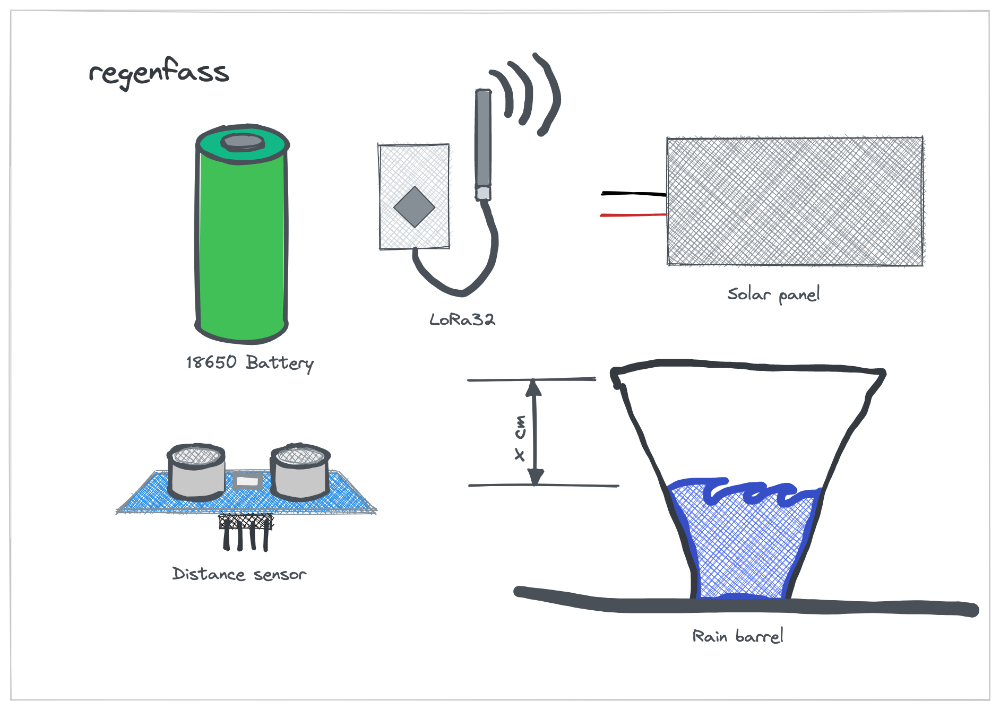
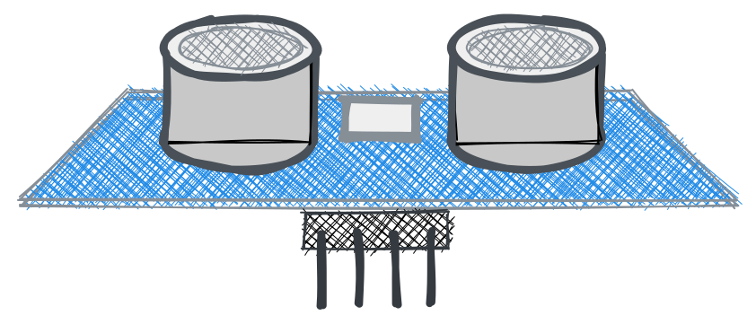
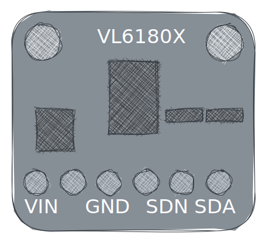
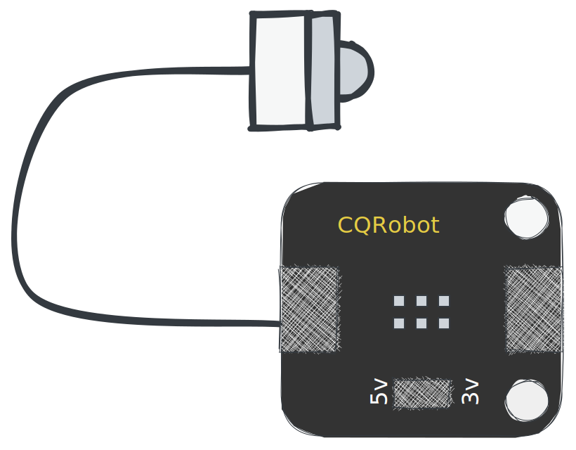
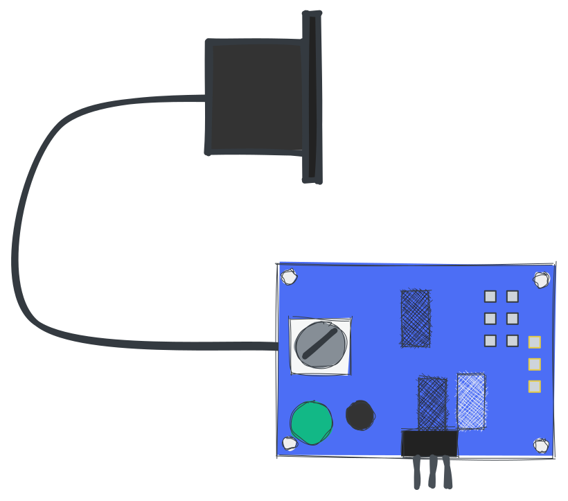
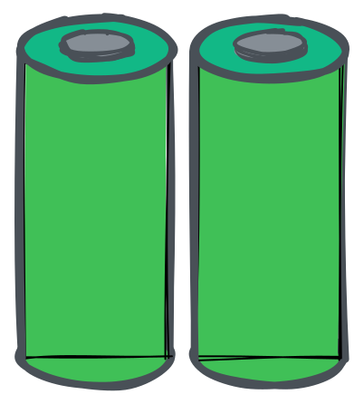
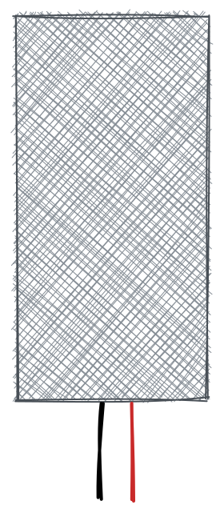
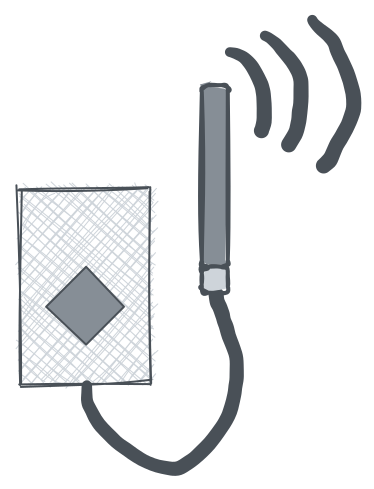
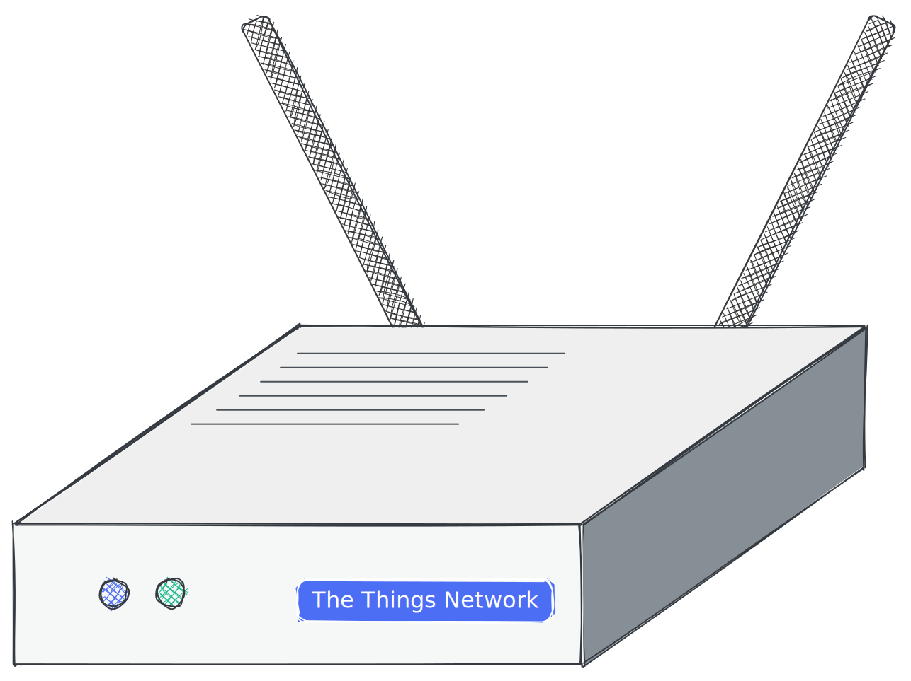
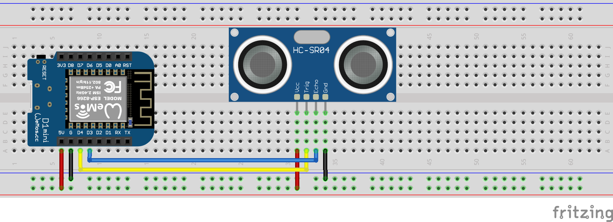

# canon de pluie

> Ce projet parle d'un réservoir d'eau intelligent. Il mesure le niveau d'eau et envoie les données à un serveur. Le serveur peut être utilisé pour contrôler la pompe à eau. La pompe peut être contrôlée via une interface Web ou via un bot télégramme. Il utilise un capteur à ultrasons HC-SR04 pour mesurer le niveau d'eau. Les données sont envoyées à TTN via une passerelle Lorawan.

?> Le document original a été écrit[Anglais](README.md). La traduction a été faite avec Google Translate. Si vous trouvez des erreurs, essayez de les ignorer. Merci!

* * *

## Tableau de contenu

1.  **Start**
    1.  Introduction
    2.  Matériel
    3.  Logiciel flash
2.  **Matériel**
    1.  Capteurs
    2.  Alimentation électrique
    3.  Logement
    4.  Microcontrôleur
    5.  Passerelle (facultative)
3.  **Assemblage**
    1.  Capteur au contrôleur
    2.  Puissance au contrôleur
    3.  Difficulté
4.  **Installation**
    1.  TTN
        1.  Créer un compte
        2.  Créer une application
        3.  Configurer le décodeur
        4.  Copier des informations d'identification
    2.  Appareil
        1.  Télécharger le pilote
        2.  Clignotant
        3.  Configuration
5.  **Débogage**
    1.  Moniteur en série
    2.  Console TTN
    3.  Client MQTT
    4.  Écrans
6.  **Génie des données**
    1.  Nœud rouge
    2.  Gratter
    3.  Habile Alexa
    4.  Azure Connect

* * *

## Démarrage rapide

### Démarrage rapide - Introduction

Le QuickStart est conçu pour les personnes qui veulent commencer tout de suite et une connaissance approfondie de l'IoT avec le cadre Arudino. Si vous voulez comprendre comment cela fonctionne, vous pouvez lire le[documentation](#hardware).

### Démarrage rapide - Présentation du matériel

Vous avez besoin des parties suivantes:

-   Microcontrôleur avec puce Lora
-   Capteur
-   Alimentation électrique
-   Logement

?> Si vous voulez en savoir plus sur les pièces, vous pouvez lire le[documentation matérielle](#Hardware).

### Démarrage rapide - Logiciel flash

1.  Connectez votre carte à votre ordinateur et
2.  Cliquez sur le bouton suivant:

<esp-web-install-button manifest="/static/firmware_build/manifest.json"></esp-web-install-button>

?> Si vous voulez en savoir plus sur le processus clignotant, vous pouvez lire le[documentation de configuration](#Setup).

## Matériel

1.  [Capteurs](#Sensors)
2.  [Alimentation électrique](#Power-supply)
3.  [Logement](#Housing)
4.  [Microcontrôleur](#Microcontroller)
5.  [Porte](#Gateway)

### Capteurs

Pour mesurer le niveau d'eau, vous avez besoin d'un capteur. Il n'est pas facile de trouver un capteur imperméable et peut être utilisé dans un réservoir d'eau. Les capteurs suivants sont pris en charge et recommandés:

#### Débutant

Si vous êtes un débutant, nous vous recommandons d'utiliser des capteurs bon marché pour construire votre premier prototype. Les capteurs suivants sont pris en charge et recommandés:

| Partie                                              | Description                                                                                                                                                                                                                                                                                                                                                                                                                                                                                                                                                                                                                                                                                                                                                                                                                                                                                                                                     |
| --------------------------------------------------- | ----------------------------------------------------------------------------------------------------------------------------------------------------------------------------------------------------------------------------------------------------------------------------------------------------------------------------------------------------------------------------------------------------------------------------------------------------------------------------------------------------------------------------------------------------------------------------------------------------------------------------------------------------------------------------------------------------------------------------------------------------------------------------------------------------------------------------------------------------------------------------------------------------------------------------------------------- |
|  | [Capteur à ultrasons HC-SR04](https://amzn.to/3MHNrbJ)Le capteur est relativement bon marché et facile à utiliser. Ce n'est pas étanche. Vous devez le mettre dans un boîtier étanche. Nous recommandons ce capteur si vous voulez juste l'essayer. Il n'est pas recommandé pour une utilisation à long terme. Le**HC-SR04**Le capteur est un capteur à ultrasons utilisé pour la mesure de la distance. Il émet des ondes sonores à haute fréquence et détecte le temps nécessaire aux ondes pour rebondir après avoir frappé un objet. Cette fois est ensuite utilisée pour calculer la distance entre le capteur et l'objet. Il a une gamme allant jusqu'à 4 mètres et peut être interfacé avec des microcontrôleurs comme Arduino, Raspberry Pi, etc. Le HC-SR04 est couramment utilisé dans la robotique, l'automatisation, les systèmes de sécurité et d'autres applications qui nécessitent une détection de distance précise et fiable. |
|              | [VL6180X](https://amzn.to/3zVEFPM)Le capteur de vol est relativement bon marché et facile à utiliser. Le module de distance laser VL6180X est un capteur qui utilise un laser pour mesurer la distance entre le capteur et un objet. Il s'agit d'un capteur de temps de vol (TOF), ce qui signifie qu'il mesure le temps nécessaire à la lumière laser pour rebondir sur un objet et revenir au capteur. Le capteur n'est pas étanche mais a une plus grande acuratie. Vous devez le mettre dans un boîtier étanche. Nous recommandons ce capteur si vous voulez juste l'essayer. Il n'est pas recommandé pour une utilisation à long terme.                                                                                                                                                                                                                                                                                                    |

#### Avancé

Si vous souhaitez utiliser ce projet pendant longtemps, nous vous recommandons d'utiliser des capteurs plus chers. Les capteurs suivants sont pris en charge et recommandés:

| Partie                                                                 | Description                                                                                                                                                                                                                                                                                                                                                                                                                                                                                                                                                                                                                                                                                                                                                                                                                                                                                                                                                                                                                                                                                                                                                                                                                                                                                                                                               |
| ---------------------------------------------------------------------- | --------------------------------------------------------------------------------------------------------------------------------------------------------------------------------------------------------------------------------------------------------------------------------------------------------------------------------------------------------------------------------------------------------------------------------------------------------------------------------------------------------------------------------------------------------------------------------------------------------------------------------------------------------------------------------------------------------------------------------------------------------------------------------------------------------------------------------------------------------------------------------------------------------------------------------------------------------------------------------------------------------------------------------------------------------------------------------------------------------------------------------------------------------------------------------------------------------------------------------------------------------------------------------------------------------------------------------------------------------- |
|                    | [Contactez le capteur de niveau d'eau](https://amzn.to/41sKAaL)Ce capteur utilise des principes optiques pour détecter les niveaux de liquide et est connu sous le nom de capteur de niveau de liquide d'eau photoélectrique. Un avantage majeur de ce type de capteur est son excellente sensibilité et manque de pièces mécaniques, ce qui conduit à un étalonnage moins fréquent. La sonde du capteur elle-même est petite et flexible en termes d'orientation de placement, ce qui lui permet de détecter une variété de conditions telles que le déversement de solution, la sécheresse et le niveau horizontal. De plus, ce capteur peut fonctionner comme un système de rappel et d'alarme. L'appareil dispose d'une diode émetteur intégrée et d'un phototransistor, avec la partie chargée complètement isolée du liquide contrôlé, assurant la sécurité.                                                                                                                                                                                                                                                                                                                                                                                                                                                                                        |
|  | [Capteur à ultrasons à l'épreuve de l'eau](https://amzn.to/3MNk4F2)Le JSN-SR04T est un module de capteur à ultrasons qui utilise la technologie du sonar pour détecter la distance des objets. Ce module compact et facile à utiliser comprend une grande précision et une fiabilité, ce qui en fait un choix idéal pour un large éventail d'applications, notamment la robotique, l'automatisation et les systèmes de sécurité. Le capteur a une plage de détection allant jusqu'à 5 mètres et peut détecter des objets dans un angle de 15 degrés. Il fonctionne à une fréquence de 40 kHz et a une résolution de 1 cm. Le module comprend également une fonction de compensation de température intégrée, garantissant des lectures stables et précises même dans des conditions de température variables.**Le JSN-SR04T**Le module est conçu avec un boîtier imperméable et anti-poussière, ce qui le rend adapté à une utilisation dans des environnements difficiles. Il est facile à installer et intègre de manière transparente avec une large gamme de microcontrôleurs, tels que Arduino et Raspberry Pi, via son interface simple à trois broches. Dans l'ensemble, le module de capteur à ultrasons JSN-SR04T est un excellent choix pour tous ceux qui recherchent une solution de mesure de distance fiable et précise pour leurs projets. |

### Alimentation électrique

Pour alimenter le microcontrôleur, vous avez besoin d'une alimentation. La batterie de 18650 est la meilleure option. Il est bon marché et vous pouvez le facturer avec un panneau solaire. Mais vous pouvez également utiliser une banque électrique ou une alimentation USB.

| Partie                                                  | Description                                                                                                                                                                                                                                                                                                                                                                                                                                                                                                                                                                                                                                                                                                                                                                                                                                                                                                                                                                                                                               |
| ------------------------------------------------------- | ----------------------------------------------------------------------------------------------------------------------------------------------------------------------------------------------------------------------------------------------------------------------------------------------------------------------------------------------------------------------------------------------------------------------------------------------------------------------------------------------------------------------------------------------------------------------------------------------------------------------------------------------------------------------------------------------------------------------------------------------------------------------------------------------------------------------------------------------------------------------------------------------------------------------------------------------------------------------------------------------------------------------------------------- |
|     | Il existe de nombreux types de batteries. Les plus courants sont le lithium ion, le lithium polymère et le phosphate de fer au lithium. Le**Batterie 18650**est une batterie au lithium ion. C'est la meilleure option pour ce projet. Il est bon marché et vous pouvez le facturer avec un panneau solaire. Il est en ion lithium et peut être chargé jusqu'à 500 fois. La batterie 18650 a une tension de 3,7 V et peut avoir une capacité d'Araound 2200mAh. Le panneau solaire a une tension de 5V et une puissance de 2W. Le panneau solaire peut charger la batterie en 3 heures. Notre capteur a besoin de 5 V et 100MA. Le microcontrôleur a besoin de 5 V et 100MA. Nous avons donc besoin de deux batteries de 18650 un régulateur de tension pour obtenir 5V. La batterie n'est pas étanche. Vous devez le mettre dans un boîtier étanche. Prenez également soin des températures élevées. La batterie peut exploser si elle est trop chaude. Nous recommandons cette batterie si vous souhaitez l'utiliser pendant longtemps. |
|  | **Panneau solaire:**Puisque nous sommes dans notre jardin, nous pouvons utiliser un panneau solaire. Il est étanche et peut être utilisé sous la pluie. Il est fait de silicium polycristallin et a une puissance de 2W. Si vous achetez un panneau solaire, vous devez faire Shure qu'il a une sortie 5V avec au moins 400mA. Pour charger nos batteries, nous avons besoin d'un contrôleur de charge. Heureusement, le microcontrôleur a une construction de contrôleur de charge. Nous pouvons donc utiliser directement le panneau solaire.                                                                                                                                                                                                                                                                                                                                                                                                                                                                                           |

### Logement

Pour protéger le capteur et le microcontrôleur, vous avez besoin de boîtiers. Le boîtier doit être étanche et un peu résistant aux températures élevées et aux rayonnements UV.
Utiliser**Pivot**est bon pour les prototypes. Il n'est pas étanche et peut être détruit par le rayonnement UV. Utiliser**Pivot**pour une utilisation à long terme. Il est étanche et résistant aux UV. Vous pouvez également utiliser**Abs**. Il est étanche et résistant aux UV.

Même**tupperware**est une bonne option. Il est étanche et résistant aux UV.

### Microcontrôleur

Le microcontrôleur est le cerveau du système. Il est responsable de la mesure du niveau d'eau et de l'envoi des données au serveur. Les microcontrôleurs suivants sont pris en charge et recommandés:

| Partie                                                              | Description                                                                                                                                                                                                                                                                                                                                                                                                                                                                                                                                                                                                                                                                                                                                                                                                                                                                                                                                                                                                                                                                                                                                                                                                                                                                                                                                                                                                                                                                                                                                                                                                                                                                                                                                                                                                                                                                                                             |
| ------------------------------------------------------------------- | ----------------------------------------------------------------------------------------------------------------------------------------------------------------------------------------------------------------------------------------------------------------------------------------------------------------------------------------------------------------------------------------------------------------------------------------------------------------------------------------------------------------------------------------------------------------------------------------------------------------------------------------------------------------------------------------------------------------------------------------------------------------------------------------------------------------------------------------------------------------------------------------------------------------------------------------------------------------------------------------------------------------------------------------------------------------------------------------------------------------------------------------------------------------------------------------------------------------------------------------------------------------------------------------------------------------------------------------------------------------------------------------------------------------------------------------------------------------------------------------------------------------------------------------------------------------------------------------------------------------------------------------------------------------------------------------------------------------------------------------------------------------------------------------------------------------------------------------------------------------------------------------------------------------------- |
|  | Le[Soueure SX1262 LORA Module 868](https://amzn.to/3UFRGq5)est un microcontrôleur avec un module LORA. Il est bon marché et facile à utiliser. Le SX1262 est un émetteur-récepteur à longue portée hautement intégré conçu pour une utilisation dans une variété d'applications de communication sans fil. Il dispose d'un mode de consommation d'alimentation ultra-bas, ce qui le rend idéal pour les applications alimentées par batterie qui nécessitent une longue durée de vie de la batterie. Le SX1262 utilise la technique de modulation LORA, qui permet une communication à longue portée avec une consommation d'énergie minimale. Avec une gamme allant jusqu'à 15 km dans des conditions de regard et jusqu'à 2 km dans les environnements urbains, le SX1262 est un excellent choix pour les applications de communication sans fil à longue portée. L'émetteur-récepteur fonctionne dans la plage de fréquences 860-930 MHz, ce qui le rend compatible avec une large gamme d'exigences réglementaires régionales. Il présente également une sensibilité élevée de -148 dBm, permettant une communication fiable même dans des environnements de signal bruyants ou faibles. Le SX1262 est conçu avec une interface hautement configurable, ce qui facilite l'intégration dans une large gamme d'applications. Il dispose également d'un mode de veille de faible puissance, ce qui réduit la consommation d'énergie lorsque l'émetteur-récepteur n'est pas utilisé. Dans l'ensemble, le SX1262 est une solution d'émetteur-récepteur très polyvalente et fiable qui est idéale pour une large gamme d'applications de communication sans fil, y compris l'IoT, la mesure intelligente et l'automatisation industrielle.**Ce n'est pas étanche.** You have to put it in a waterproof housing. We recoment this microcontroller if you just want to try it out. It is not recommended for long term use. |

### Porte

Check the TTN map to see if there is a gateway near you. If there is no gateway near you, you can buy a gateway but you need a internet connection. The gateway is the bridge between the microcontroller and the TTN server. The following gateways are supported and recommended:

| Partie                                               | Description                                                                                                                                                                                                                                                                                                                                                                                                                                                                                                                                                                                                                                                                                                                                                                                                                                                          |
| ---------------------------------------------------- | -------------------------------------------------------------------------------------------------------------------------------------------------------------------------------------------------------------------------------------------------------------------------------------------------------------------------------------------------------------------------------------------------------------------------------------------------------------------------------------------------------------------------------------------------------------------------------------------------------------------------------------------------------------------------------------------------------------------------------------------------------------------------------------------------------------------------------------------------------------------- |
|  | [Passerelle intérieure TTN](https://amzn.to/3L1x1JN)La passerelle est conçue pour fonctionner de manière transparente avec le réseau V3 Network, qui offre une gamme de fonctionnalités telles que l'activation de l'appareil sécurisé, la couverture globale et la gestion facile des appareils. Il propose également une prise en charge intégrée pour Bluetooth Low Energy (BLE) et Wi-Fi, permettant une configuration et une gestion faciles à l'aide d'un smartphone ou d'un ordinateur. Dans l'ensemble, les choses que la passerelle intérieure de Lorawan intérieure TTNV3 est un excellent choix pour tous ceux qui recherchent une passerelle fiable et facile à utiliser pour leur réseau Lorawan. Il est abordable, économe en énergie et rempli de fonctionnalités qui en font un choix idéal pour les applications IoT commerciales et industrielles. |

## 3. Assemblage

1.  [Capteur au contrôleur](#sensor-to-controller)
2.  [Puissance au contrôleur](#power-to-controller)
3.  [Difficulté](#trouble-shooting)

### Capteur au contrôleur

Cet exemple illustre comment assembler le capteur HC-SR04 au microcontrôleur. Le capteur est connecté au microcontrôleur avec un câble à 4 broches. Le câble jaune est le câble de déclenchement. Le câble bleu est le câble d'écho. Le câble rouge est le câble 5V. Le câble noir est le câble de terre.

### Puissance au contrôleur

### Difficulté

* * *

#### Lorawan

-   Passerelle Lorawan

#### Micro-contrôleur

Il est évident que vous avez besoin d'une carte pour exécuter le logiciel. Mais vous avez également besoin d'une puce Lora pour envoyer les données à TTN. Les conseils suivants sont pris en charge:

-   [Ttgo lora32](Hardware/TTGOLoRa32.md)
-   [Heltec lora32](Hardware/HeltecLoRa32.md)

### Schématique

### Pièces imprimées en 3D

## Logiciel

### Arduino

-   [Arduino](Software/Arduino/README.md)

### Serveur

-   [Serveur](Software/Server/README.md)

### Bot télégramme

-   [Bot télégramme](Software/TelegramBot/README.md)

## Contribuer

-   <https://github.com/ttnleipzig/regenfass-hc-sr04/>
-

## Licence

[Attribution-noncommercial-sharealike 4.0 International (CC BY-NC-SA 4.0)](https://creativecommons.org/licenses/by-nc-sa/4.0/)

**Vous êtes libre de:**

-   Partager - Copier et redistribuer le matériel dans n'importe quel moyen ou format
-   Adapter - remix, transformer et s'appuyer sur le matériau

* * *

_Fait avec ❤️ par[doc sirifier](https://docsify.js.org/)_
